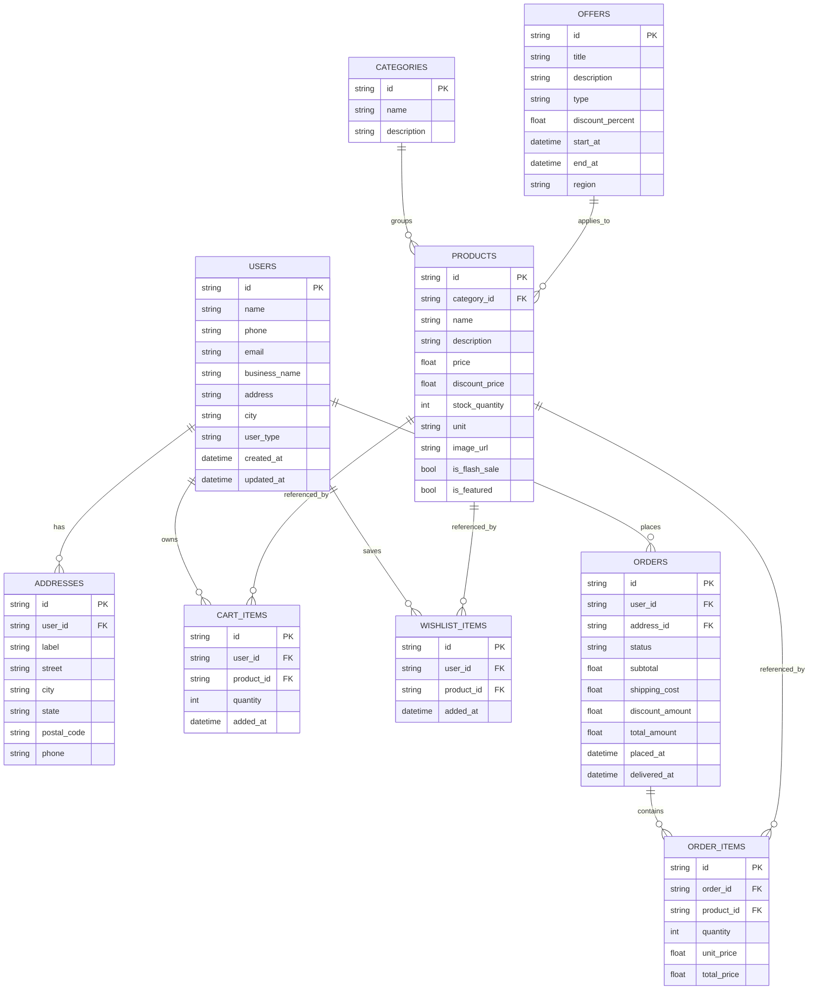
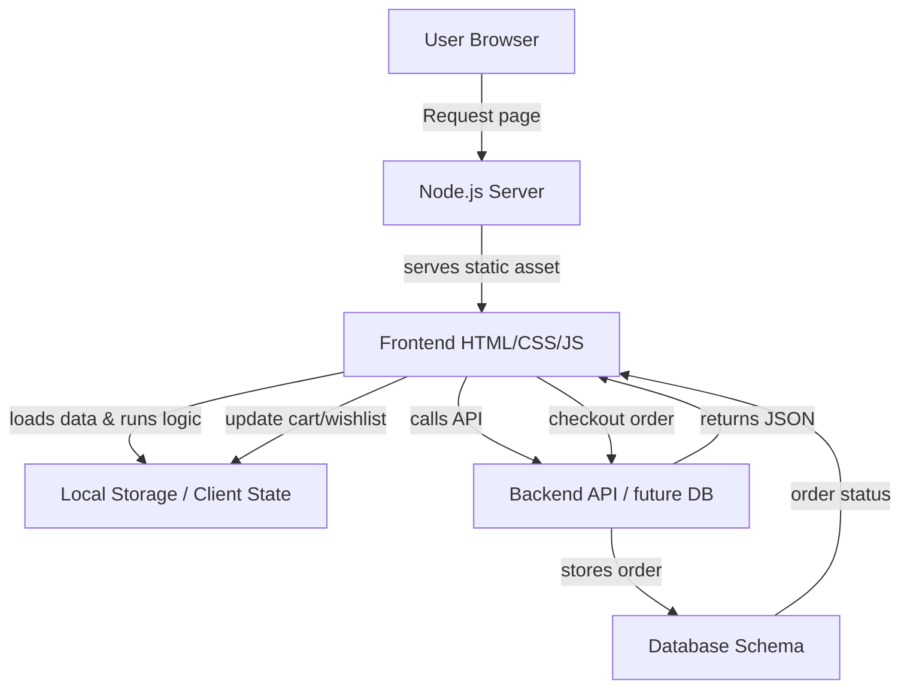

# Apna Mandi - Wholesale Marketplace for Street Food Vendors

## 🌟 Overview

**Apna Mandi** is a wholesale e-commerce marketplace built to empower street food vendors, small-scale food businesses, and local caterers.
The platform connects vendors with fresh produce, wholesale ingredients, bulk supplies, and regional deals through a mobile-first shopping experience.

## 🧩 System Architecture

Apna Mandi is designed as a hybrid static/frontend application with a lightweight Node.js backend.
The backend serves static assets, renders EJS views for page templates, and exposes a simple API endpoint.

### Architecture Components

- Frontend static assets: `frontend/index.html`, `frontend/css/*`, `frontend/js/*`
- View templates: `frontend/views/*.ejs`, `frontend/views/partials/*`
- Backend server: `backend/server.js`
- Node dependencies: Express, EJS, CORS, dotenv, Morgan

### Runtime Flow

1. User lands on `GET /` served by `index.html`
2. User navigates to pages under `/pages/*`
3. Backend renders EJS views and serves static JS/CSS
4. User interactions are handled client-side in JavaScript with browser storage state
5. API endpoints are available for future integration at `/api`

## 🎯 Target Audience

- Street food vendors
- Small-scale food businesses
- Local restaurants and cafes
- Food truck operators
- Home-based food businesses

## 🚀 Key Features

### 📱 **User Authentication & Onboarding**
- **Mobile OTP Verification**: Secure login/signup with phone number verification
- **Profile Management**: Complete vendor profile setup with business details
- **Location Services**: Location-based product recommendations and delivery

### 🛒 **Shopping Experience**
- **Product Categories**: Vegetables, Spices, Dairy, Poultry, Grains, Beverages
- **Search & Filter**: Advanced search functionality with category filters
- **Product Details**: Comprehensive product information with pricing and reviews
- **Shopping Cart**: Hub cart system for managing multiple items
- **Wishlist**: Save favorite products for future purchases

### 💰 **Pricing & Offers**
- **Flash Sales**: Time-limited offers with countdown timers
- **Special Offers**: Surplus deals and bulk discounts
- **Wholesale Pricing**: Competitive prices for bulk purchases
- **Regional Deals**: Location-specific offers (e.g., "Top Deals in Mumbai")

### 📦 **Order Management**
- **Checkout Process**: Streamlined payment and delivery setup
- **Delivery Information**: Address management and delivery preferences
- **Order Tracking**: Real-time order status and tracking
- **Order Confirmation**: Detailed order summaries and receipts

### 🎨 **User Interface**
- **Mobile-First Design**: Optimized for mobile devices
- **Modern UI/UX**: Clean, intuitive interface with smooth animations
- **Responsive Design**: Works seamlessly across all screen sizes
- **Accessibility**: User-friendly navigation and interactions

## 📁 Current File Structure

```
Apna-Mandi/
├── index.html                    # Landing page with loading animation
├── Homepage.html                 # Main dashboard with categories and deals
├── loginorsignuppage.html        # Authentication and OTP verification
├── searchfeedpage.html           # Product search and category browsing
├── productdetailspage.html       # Individual product information
├── hubcartpage.html             # Shopping cart management
├── checkoutpage.html            # Payment and order processing
├── delivaryinformationpage.html # Delivery address and preferences
├── orderconfromationpage.html   # Order confirmation and details
├── ordertrackingpage.html       # Order status tracking
├── mywishlistpage.html          # Saved products and favorites
├── specialofferspage.html       # Flash sales and special deals
├── accountorprofilepage.html    # User profile and account settings
├── locationpage.html            # Location services and delivery areas
├── help&resources.html          # Customer support and resources
└── README.md                    # Project documentation
```

## 🛠️ Technical Stack

### Frontend
- HTML5 for page structure
- CSS3 + Tailwind CSS utility classes for styling
- Vanilla JavaScript for page logic and user interaction
- Local storage for session persistence

### Backend
- Node.js and Express for serving pages and static assets
- EJS for rendering reusable page templates
- CORS for cross-origin support
- dotenv for environment configuration

### Dependencies
- `express`
- `ejs`
- `dotenv`
- `cors`
- `morgan`
- `nodemon` (dev)

## 🧠 Business Logic & Feature Logic

### Sign-up / Login Flow
- User enters mobile number
- OTP is generated client-side or mocked for verification
- Authentication state is stored in browser storage
- Once verified, the user is routed to the homepage

### Product Discovery
- Homepage displays categories and featured deals
- Search page allows query matching product name, category, or tag
- Product detail page shows price, description, stock, and add-to-cart options

### Cart & Wishlist
- Cart stores selected products and quantities in local storage
- Subtotal updates dynamically
- Users can remove items and change quantities
- Wishlist stores favorite products for later purchases

### Checkout Flow
- Users choose delivery information
- Order summary shows product totals, shipping, and discounts
- Checkout validates required fields before allowing completion

### Order Management
- Order confirmation page displays purchase details and expected delivery
- Tracking page illustrates shipment progress through status steps
- Account page provides vendor profile and order history links

### Offers & Location
- Special offers page highlights flash sales and bulk deals
- Location page captures city/region preference for localized pricing
- Regional deals drive targeted vendor promotions

## 🗂️ ER Diagram and Data Model

Below is a reference ER diagram for the expected data model.



## 🧾 Database Schema Reference

A recommended schema for future persistence is below.

### users
- `id` (string, PK)
- `name` (string)
- `phone` (string)
- `email` (string)
- `business_name` (string)
- `address` (string)
- `city` (string)
- `user_type` (string)
- `created_at` (datetime)
- `updated_at` (datetime)

### categories
- `id` (string, PK)
- `name` (string)
- `description` (string)

### products
- `id` (string, PK)
- `category_id` (FK -> categories.id)
- `name` (string)
- `description` (string)
- `price` (float)
- `discount_price` (float)
- `stock_quantity` (int)
- `unit` (string)
- `image_url` (string)
- `is_flash_sale` (boolean)
- `is_featured` (boolean)

### addresses
- `id` (string, PK)
- `user_id` (FK -> users.id)
- `label` (string)
- `street` (string)
- `city` (string)
- `state` (string)
- `postal_code` (string)
- `phone` (string)

### cart_items
- `id` (string, PK)
- `user_id` (FK -> users.id)
- `product_id` (FK -> products.id)
- `quantity` (int)
- `added_at` (datetime)

### wishlist_items
- `id` (string, PK)
- `user_id` (FK -> users.id)
- `product_id` (FK -> products.id)
- `added_at` (datetime)

### orders
- `id` (string, PK)
- `user_id` (FK -> users.id)
- `address_id` (FK -> addresses.id)
- `status` (string)
- `subtotal` (float)
- `shipping_cost` (float)
- `discount_amount` (float)
- `total_amount` (float)
- `placed_at` (datetime)
- `delivered_at` (datetime)

### order_items
- `id` (string, PK)
- `order_id` (FK -> orders.id)
- `product_id` (FK -> products.id)
- `quantity` (int)
- `unit_price` (float)
- `total_price` (float)

### offers
- `id` (string, PK)
- `title` (string)
- `description` (string)
- `type` (string)
- `discount_percent` (float)
- `start_at` (datetime)
- `end_at` (datetime)
- `region` (string)

## 📊 Data Flow Diagram



## 📌 Page Flow and Logic

### Landing Screen
- Entry point with branded loading animation
- Navigates to login/signup or homepage depending on session state

### Login / Signup
- Phone number entry and OTP verification
- Stores authentication status and user profile data

### Homepage
- Shows categories, popular products, special offers, and banners
- Allows quick access to cart, wishlist, location, and profile

### Search Feed
- Allows searching products by name, category, or keywords
- Displays search results with filters and sorting options

### Product Details
- Shows product image, description, pricing, and available quantity
- Provides add-to-cart and save-to-wishlist actions

### Hub Cart
- Displays selected items with quantity controls
- Updates subtotal and checkout button state in real time

### Checkout
- Collects payment option and order review details
- Validates delivery preferences and totals

### Delivery Information
- Captures delivery address and preferred delivery instructions
- Saves address for future checkout sessions

### Order Confirmation
- Displays completed order summary, order ID, and expected delivery window

### Order Tracking
- Shows order status progression from placed to delivered
- Provides vendor-friendly tracking information

### Wishlist
- Displays saved products for easy repurchase
- Allows moving items to cart or removing saved items

### Account / Profile
- Shows vendor profile fields and business details
- Allows editing user information, saved addresses, and location

### Special Offers
- Highlights flash deals, surplus discounts, and regional promotions
- Includes countdown and stock alerts for urgency

### Location Page
- Captures and manages delivery region preferences
- Uses regional filtering to display nearby deals

### Help & Resources
- Provides support content, FAQs, and guidance for using the app

## 🧾 A–Z Description of the Project

A — Authentication: Mobile OTP login is the entrypoint.
B — Backend: Express server serves static assets and EJS views.
C — Cart: Hub cart manages item selection, quantities, and totals.
D — Delivery: Address and delivery preferences are captured before checkout.
E — EJS: Reusable templates for view rendering.
F — Flash Sales: Dynamic offers with time-based urgency.
G — Growth: Designed for vendor onboarding and expansion.
H — Homepage: Main dashboard for browsing categories and deals.
I — Inventory: Product stock and wholesale quantity logic.
J — JavaScript: Client-side interactivity and state handling.
K — KPI: Business metrics will include order value and vendor retention.
L — Location: Region-based pricing and deal targeting.
M — Mobile-first UI: Optimized for small screens and touch navigation.
N — Navigation: Clear page routes and experience flows.
O — Orders: Checkout, confirmation, and tracking.
P — Products: Categories, details, pricing, and reviews.
Q — Quantity: Controls available product weights and bulk units.
R — Responsive design: Works across mobile and desktop.
S — Search: Product discovery across categories and offers.
T — Tracking: Order status updates and progress.
U — User Profiles: Vendor account, business details, and preferences.
V — Vendor focus: Designed for street food and small business needs.
W — Wishlist: Save favorite items for later purchase.
X — eXperience: Smooth UI with focused mobile-first interaction.
Y — Yield: Cost savings delivered through wholesale pricing.
Z — Zero friction: Simple onboarding and checkout flow.

## 🚀 How to Run Locally

### Backend

```bash
cd backend
npm install
npm run dev
```

Then open `http://localhost:5000` in your browser.

### Frontend Static Option

You can also open `frontend/index.html` directly in a browser for static preview.

## ✅ Existing Backend Routes

- `GET /` → `frontend/index.html`
- `GET /pages/Homepage` → renders `Homepage.ejs`
- `GET /pages/login` → renders `loginorsignuppage.ejs`
- `GET /pages/account` → renders `accountorprofilepage.ejs`
- `GET /pages/hubcart` → renders `hubcartpage.ejs`
- `GET /pages/checkout` → renders `checkoutpage.ejs`
- `GET /pages/searchfeed` → renders `searchfeedpage.ejs`
- `GET /pages/specialoffers` → renders `specialofferspage.ejs`
- `GET /pages/productdetails` → renders `productdetailspage.ejs`
- `GET /pages/mywishlist` → renders `mywishlistpage.ejs`
- `GET /pages/orderconfirmation` → renders `orderconfromationpage.ejs`
- `GET /pages/ordertracking` → renders `ordertrackingpage.ejs`
- `GET /pages/deliveryinfo` → renders `delivaryinformationpage.ejs`
- `GET /pages/location` → renders `locationpage.ejs`
- `GET /pages/help` → renders `helpandresourcespage.ejs`
- `GET /api` → returns JSON status

## 📈 Upcoming Plan & Roadmap

### Phase 1 — Core MVP
- Add persistent backend storage (MongoDB / PostgreSQL)
- Convert mock state to real API-driven cart/wishlist/order support
- Add authentication sessions and secure login
- Add product management admin interface

### Phase 2 — Vendor Experience
- Add vendor dashboard and sales analytics
- Add supplier management and inventory controls
- Add vendor reviews and product ratings
- Add push notifications for flash deals and order updates

### Phase 3 — Fulfillment & Scaling
- Integrate payment gateways (UPI, cards, wallets)
- Add delivery partner tracking and live location
- Add order history, returns, and refund workflows
- Expand regional product availability and localization

### Phase 4 — Growth & Insights
- Add business intelligence dashboards
- Add campaign management for promotions and seasonal offers
- Add multi-city expansion and market-specific catalogs
- Add machine learning recommendations and demand forecasting

## 📞 Support & Resources

- FAQ section for core workflow guidance
- Contact support via email or phone in future releases
- Terms, privacy policy, and vendor agreement pages planned
- Tutorial guides and onboarding walkthroughs

---

**Apna Mandi** — Empowering street food vendors with quality ingredients, smarter ordering, and local deals. 🍽️✨
